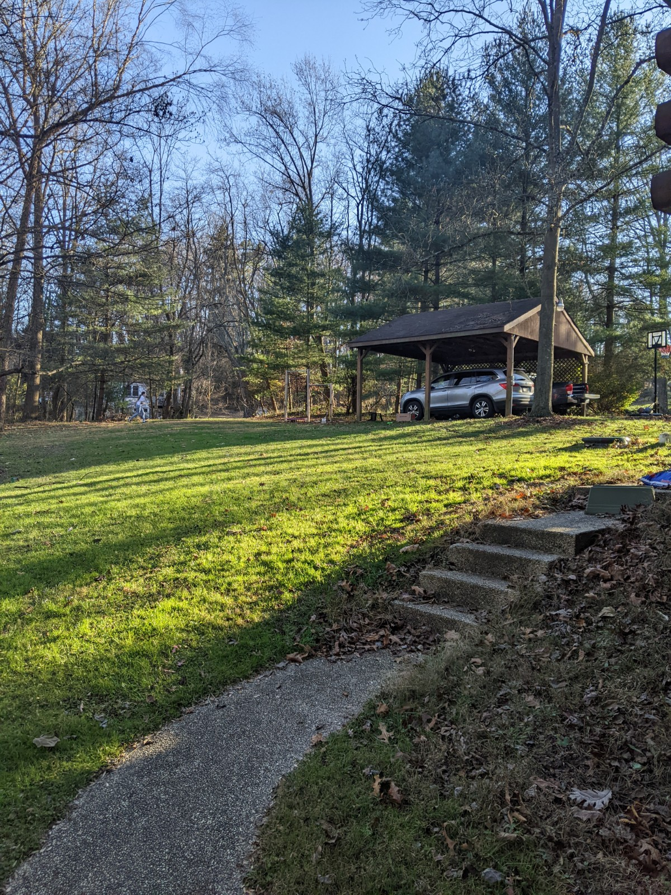
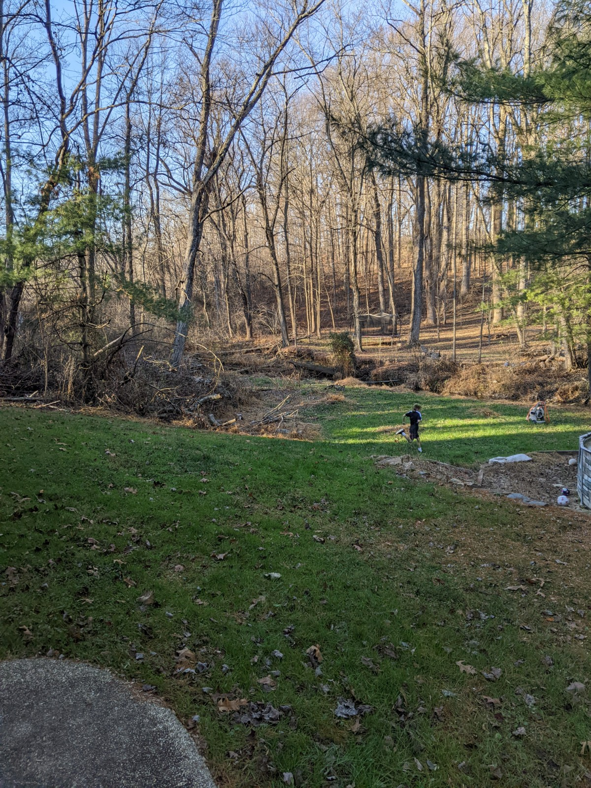

# Thursday 01/26/2023
##### Workout:
Ride 30 5:1 Interval **CJ** 
https://connect.garmin.com/modern/activity/10385563417

# Monday 01/23/2023
##### Workout:
Run 40 Min to the hills and back **CJ** 
https://connect.garmin.com/modern/activity/10367414006

# Sunday 01/22/2023
##### Workout:
Ride 40 Min steady on Trainer **CJ** 
https://connect.garmin.com/modern/activity/10361768545

# Saturday 01/21/2023
##### Workout:
Run 20 Min mix w/ sprints on TM **CJ** 

# Wednesday 01/18/2023
##### Workout:
Run - Church Weis 7min Run; 1min Walk **CJ** 
https://connect.garmin.com/modern/activity/10336235816

# Monday 01/16/2023
##### Workout:
Run - Weis-Church 5min Run; 1min Walk **CJ** 
https://connect.garmin.com/modern/activity/10321917246

100 Shiko **CJ** 

# Thursday 01/05/2023
##### Workout:
6x 7min Run; 2min Walk **CJ** 
https://connect.garmin.com/modern/activity/10249654795

100 Shiko **CJ** 

# Tuesday 01/03/2023
##### Workout:
4x 7min Run; 2min Walk **CJ** 

100 Shiko **CJ** / **Emma** 

# Monday 01/02/2023
##### Workout:
40 min bike **CJ** / **Wesley** / **Charlie** 

50 Shiko **CJ** 

# Sunday 01/01/2023
##### Workout:
5k **CJ** 
6x 2:00 Run ; :30 Walk **Emma** 
4x 2:00 Run ; 2:00 Walk **Wesley** 

# Wednesday 12/21/2022
##### Workout:
8x 4:00 Run ; 30 Walk

***CJ*** 

# Monday 12/19/2022
##### Workout:
6x 5:00 Run ; 1:00 Walk

***CJ*** 

# Saturday 12/17/2022
##### Workout:
2 Mile Run 22:00

***CJ*** 

# Monday 12/13/2022
##### Workout:
6x 4:00 Run ; 1:30 Walk

***CJ*** 

# Saturday 12/11/2022
##### Workout:
BSx8 95-115-145x2 
BPx8 95-115-115x3 
DLx8 115-135-165x2 

***CJ*** 

# Friday 12/10/2022
##### Workout:
6x 3:00 Run ; :30 Walk

***CJ*** 

# Tuesday 12/06/2022
##### Workout:
8x 3:00 Run ; :30 Walk

***CJ*** 

# Sunday 12/04/2022
##### Workout:
10x 2:00 Run ; :30 Walk

***CJ*** 

# Thursday 12/01/2022
##### Workout:
15 rounds
for round number 
handstand hold 
situps 

***Charlie*** 
***Wesley*** 

# Tuesday 11/27/2022
##### Warmup
30sec/30sec x 10 Single Unders 

##### Strength
BSx8 95-115-135 
BPx8 95-115-125 
DLx8 115-135-155 

##### Workout:
Every 3 minutes for 4 rounds complete: 
14 walking lunges 
14 burpee box step-ups 

***CJ*** 

# Monday 11/26/2022
##### Warmup
300 Single Unders 

##### Cardio
Run 2min / Walk 1min x 6

##### Workout:
Fran 
21-15-9 reps for time of: 
Thrusters (65) 
Pull-Ups 

***CJ 3:49  /scalled pullups/*** 
***Charleie 2:52  /scalled/*** 

# Saturday 11/26/2022
##### Warmup
300 Single Unders 

##### Cardio
Run 90 / Walk 90 x 8

##### Workout:
EMOM for 15 minutes 
Minute 1: 18 Air Squats 
Minute 2: 12 Push Press (45 lb) 
Minute 3: 6 Dips 

***CJ*** 

# Thursday 11/24/2022
##### Warmup
100 Single Unders 
50 Baskball Shots 
10 Jumping Pullups 

##### Strength
Squat: 8x3 
Bench: 8x3 
Deadlifts: 8x3

***CJ: 115,105,135*** 
***Carolyn: 35***

##### Skill:
Jumping Pullups 
Balance

##### Workout:
4 Rounds for Time 
_Turkey Trot_ 
5 Situps

***CJ: 10:20*** 
***Carolyn: 12:00***

# Wednesday 11/23/2022
##### Warmup
100 Single Unders 
50 Baskball Shots 
10 Box Jumps 
5 Monkey Bars 

##### Strength
Deadlifts: 8 rep max

***Wesley: 55*** 
***Emma: 85***

##### Skill:
Jumping Pullups

##### Workout:
3 Rounds for Time 
(House Loop) Run 
5 Box Pushups

***Wesley: 5:28*** 
***Emma: 6:07***

 

##### Fun:
Balance Board Throw and Catch

---
# Tuesday 11/22/2022
##### Warmup
100 Single Unders

##### Strength
Bench Press: 3 rep max

***Charlie: 60*** 
***Wesley: 50***

##### Skill:
_10 Minutes_ 
Plyometric Jumps: Forward, Backward, Lateral (using floor grid)

##### Workout:
_20 Minutes_ 
9 Knees to Chest (buy in) followed immediately by  30 Second Sprints

##### Fun:

---

# Monday 11/21/2022
##### Warmup
21/15/9 Single Unders .. Unborken 

##### Strength
Jumping Pullups

##### Skill:
_10 Minutes_ 
Boxing footwook, jabs, combos

##### Workout:
21/15/9 
Single Unders
Burpies over Bench

##### Fun:
Jump onto or over a Beam while catching footballs

---

